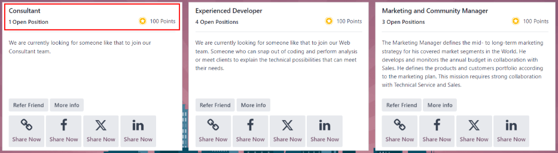
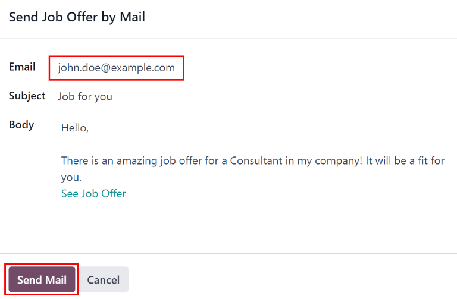

===================
Share job positions
===================

In order to earn referral points, a user must first share a job position, so the applicant can apply
for the position. Job positions can be shared in several ways within the *Referrals* application,
through the :ref:`View Jobs <referrals/view-jobs>` button and the :ref:`Email A Friend
<referrals/email-jobs>` button, located at the bottom of the *Referrals* app dashboard.

.. note::
   Sharing jobs can **only** occur after onboarding slides have been viewed or skipped.

.. _referrals/view-jobs:

View Jobs
=========

To see all job positions that are actively recruiting candidates, click the :guilabel:`View Jobs`
button on the main Referrals dashboard. This presents all job positions, with each individual job
presented in its own card.

         displayed on the card.

Each job position card contains the following information:

- The title of the job position. This information is taken from the :guilabel:`Job Position` field
  of the job form.
- The number of positions being recruited. This information is taken from the :guilabel:`Expected
  New Employees` field of the :guilabel:`Recruitment` tab of the job form.
- The points a user will earn when an applicant applies for the position.
- The job description detailing the job position. This information is taken from the :guilabel:`Job
  Position` tab of the job form.

To see all the details for a job position, click the :guilabel:`More Info` button on the specific
card. This opens the job position webpage in a new browser tab. This is what an applicant sees
before applying for a position.

.. note::
   Only published job positions will be visible in the Referrals app. To check which job positions
   are published or not, refer to the :doc:`recruitment/new_job` documentation.

Refer friends
=============

To share a job position with someone, click the :guilabel:`Refer Friend` button on the specific job
position card. A pre-configured :guilabel:`Send Job Offer by Mail` email pop-up window appears.
Enter the recipient's email address in the :guilabel:`Email` field.

The subject and body are populated using a default template. The subject `Job for you` appears, and
can be modified if desired.

The specific title of the job position will populate the :guilabel:`Job Position` placeholder in the
email body. The `See Job Offer` text in the email body is an individualized tracking link to the
specific job position listed on the website. When the prospective employee receives the email, the
link will send them to the job position page, where they can apply for the position, and the person
who referred them is tracked in the *Referrals* application.

If desired, add any text or closing salutation to the email body. When all edits have been made,
click :guilabel:`Send Email` to send the email, or click :guilabel:`Cancel` to close the email
pop-up window.

Share a job
===========

Other than sending an email, job positions can be shared, via social media platforms, and tracking
links to the job position. At the bottom of each job position card are four icons, and corresponding
tracking links, that can be used to share the job position, keeping track of applicants in the
*Referrals* application.

Link
----

To share the job position with a customized tracking link, click the :guilabel:`Share Now` button
with the :guilabel:`(fa-chain)` :guilabel:`chain` icon inside it. A :guilabel:`Link to Share` pop-up
window appears with the tracking link. Click :guilabel:`Copy` to copy the link. After the link is
copied, click the :guilabel:`Close` button to close the pop-up window. Next, share the link with
the prospective employee.

Facebook
--------

To share the job position using Facebook, click the :guilabel:`Share Now` button with the
:guilabel:`f (Facebook)` icon inside it.

If the user is already logged into Facebook, when the :guilabel:`f (Facebook)` icon is clicked, a
:guilabel:`Share on Facebook` page loads in a new tab, with the link populated in the main body of
the new post in a pop-up window. If the user is *not* already logged in, a log-in screen loads,
instead, prompting the user to log-in to Facebook first.

Type in any additional information to add to the post, then share the job position using the
available options in Facebook.

X (formerly Twitter)
--------------------

A job position can also be shared on X (formerly Twitter). Click the :guilabel:`Share Now` button
with the :guilabel:`X` icon inside it.

If the user is already signed in to X (formerly Twitter), when the :guilabel:`Share Now` icon is
clicked, an X (formerly Twitter) page loads in a new tab with a pre-populated message ready to post,
in a draft pop-up window. If the user is *not* already signed in, a sign-in screen loads instead,
prompting the user to sign in to X (formerly Twitter).

The default message is:

:guilabel:`Amazing job offer for (Job Position)! Check it live: (link to Job Position)`

Type in any additional information, or make any edits to the message, then share using the available
options in X (formerly Twitter).

LinkedIn
--------

To share a job position on LinkedIn, click the :guilabel:`Share Now` button with the :guilabel:`in
(LinkedIn logo)` inside it.

If the user is already logged into LinkedIn, when the :guilabel:`Share Now` button is clicked, a new
tab loads in LinkedIn, with a link to the job position at the top. If the user is *not* already
logged in, a log-in screen loads instead, prompting the user to log-in to LinkedIn first.

The job position can be shared either in a public post, or in a private message to an individual (or
group of individuals).

Type in any additional information, or make any edits to the message or post, then share using the
available options in LinkedIn.

.. _referrals/email-jobs:

Email a friend
--------------

Another way to share job opportunities is to share the entire current list of open job positions
instead of one job position at a time. To do this, navigate to the main *Referrals* app dashboard.
Click the :guilabel:`Email a friend` button at the bottom of the screen. A :guilabel:`Send Job Offer
by Mail` pop-up window appears.

Enter the email address in the :guilabel:`Email` line. The email can be sent to multiple
recipients, simply enter a comma followed by a single space after each email address. The
:guilabel:`Subject` is pre-configured with `Job for you`, but can be edited.

The email body is also populated with pre-configured text. The text that appears is:

`Hello,`

`There are some amazing job offers in my company! Have a look, they can be interesting for you\:`

`See Job Offers`

The :guilabel:`See Job Offers` text is a tracking link to a complete list of all job positions
currently being recruited for. Add any additional text and make any edits to the message body, if
necessary. Then, click :guilabel:`Send Mail` to send the email. This sends the message, and closes
the window.
