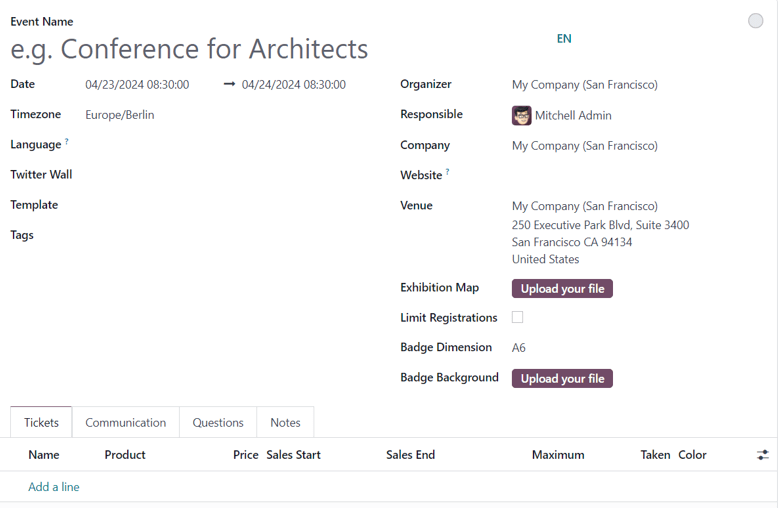

=============
Create events
=============

With Odoo *Events*, users can create and configure custom in-person or online-only events of any
size, for any occasion.

New event
=========

There are a number of ways to create events directly from the :guilabel:`Events` dashboard, with
each dashboard view option having its own process. To learn more about that check out the
:doc:`Event Essentials <event_essentials>` documentation.

The most traditional way to create an event in the Odoo *Events* application is to open the app,
revealing the :guilabel:`Events` dashboard, and click the :guilabel:`New` button in the upper-left
corner.

Clicking that :guilabel:`New` button reveals a blank event template form that can be customized and
configured in a number of different ways.

.. note::
   If certain fields do not readily appear on the event form, that means an additional application
   needs to be installed, or the database is not operating in a multi-company environment.

   For example, the :guilabel:`Twitter Wall` field **only** appears if the *Social Marketing* app is
   installed, and the :guilabel:`Company` field **only** appears if the database is working in a
   multi-company environment.

   These are just *additional* elements that can be used for an event. They are **not** required to
   create, host, and manage an event with Odoo *Events*.

Event form
==========

At the top of the event form are a series of smart buttons related to various event metrics, which
will autopopulate with pertinent data once attendees begin to register, booths and sponsors sign on
for the event, the event takes place, and so on.

Beneath that is an event form filled with various fields and tabs that can be used to customize and
configure different elements of the event.

The following are fields found on an event form:

- :guilabel:`Event Name`: the title of the event.
- :guilabel:`Date`: when the event is scheduled to take place.
- :guilabel:`Timezone`: the corresponding timezone related to the event.
- :guilabel:`Language`: designate a specific language for all event communications to be translated
  into, if necessary. This field is blank, by default, so if event-related communications are being
  sent to recipients who speak a different language, be sure to configure this field properly.
- :guilabel:`Twitter Wall`: creates a separate page on the event website to feature specific social
  posts on *X* (formerly *Twitter*) that contain pre-determined desired elements.

.. tip::
   To create and customize a :guilabel:`Twitter Wall`, type the name of the desired wall into the
   field, and select :guilabel:`Create and edit...` from the resulting drop-down menu.

   Doing so reveals :guilabel:`Create Twitter Wall` pop-up window.

   .. image:: create_events/twitter-wall-popup.png
      :align: center
      :alt: The Twitter Wall pop-up window in the Odoo Events application.

   From this window, enter a :guilabel:`Wall Name`. Then, select a certain word or hashtag for Odoo
   to search for on *X*, like `#WoodWorkingExpo24`, for example.

   Next, determine the :guilabel:`Type of tweets` Odoo should showcase with that predetermined
   criteria. The choices in this field are: :guilabel:`Recent`, :guilabel:`Popular`, or
   :guilabel:`Mixed`.

   Users also have the option to add a brief :guilabel:`Description` to the wall, as well.

   Lastly, the greyed-out, non-modifiable :guilabel:`Website URL` field will autopopulate with the
   full URL needed to access the document through the event website.

   An image can also be added to the wall by clicking the :guilabel:`🖉 (pencil)` icon that appears
   when the cursor hovers over the :guilabel:`camera` box in the upper-right corner of the pop-up
   window. Then, from the resulting file explorer window, select the desired image to be added to
   the wall.

   This :guilabel:`Twitter Wall` field **only** appears on the event form if the *Social Marketing*
   app is installed, and an *X* account has been added as a stream on the application. To learn
   more, check out the :doc:`Social marketing essentials
   <../social_marketing/essentials/social_essentials>` documentation.

- :guilabel:`Template`: choose a pre-configured event template from the resulting drop-down menu.

   Or, create a new one directly from this field, by typing in the name of the new template, and
   selecting either: :guilabel:`Create` (which creates the template, and can be edited later) or
   :guilabel:`Create and edit...` (which creates the template, and reveals a separate template page
   to configure the template in greater detail).
- :guilabel:`Tags`: add any corresponding tags to briefly describe the event (e.g. `Online`,
  `Conference`, etc.). Multiple tags can be added per event.
- :guilabel:`Organizer`: designate the organizer of the event, which could be a company, contact, or
   employee.
- :guilabel:`Responsible`: designate a user in the database to be responsible for this event.
- :guilabel:`Company`: designate which company in the database to which this event is related. This
  field **only** appears if working in a multi-company environment. If left blank, the event will
  relate to all companies in the database.
- :guilabel:`Website`: choose to restrict the publishing of this event to a specific website created
  in Odoo. If this field is left blank, the event can be published on *all* websites in the
  database.
- :guilabel:`Venue`: enter the pertinent event venue details in this field.
- :guilabel:`Exhibition Map`: if desired, click the :guilabel:`Upload your file` button to Upload
  a map of the event venue.
- :guilabel:`Limit Registrations`: if this checkbox is ticked, a limit to the amount of
  registrations is added to the event, and that desired limit amount **must** be entered in the
  blank field before :guilabel:`Attendees`.
- :guilabel:`Badge Dimension`: select a desired paper format dimension for event badges. The options
  are: :guilabel:`A4 foldable`, :guilabel:`A6`, or :guilabel:`4 per sheet`.
- :guilabel:`Badge Background`: if desired, click the :guilabel:`Upload your file` button to upload
  a custom background for event badges.

When the above fields in the event form have been adequately filled in, move on to the three tabs at
the bottom of the event form for further customization.

Those tabs are: :ref:`Tickets <create_events/event_form/tickets>`, :ref:`Communication
<create_events/event_form/communication>`, :ref:`Questions <create_events/event_form/questions>`,
and :ref:`Notes <create_events/event_form/notes>`.

.. _create_events/event_form/tickets:

Tickets tab
-----------

Create custom tickets (and ticket tiers) for events in the :guilabel:`Tickets` tab of an event form.

.. image:: create_events/tickets-tab.png
   :align: center
   :alt: A typical tickets tab on an event form in the Odoo Events application.

To create a ticket, click :guilabel:`Add a line` in the :guilabel:`Tickets` tab. Then, enter a name
for the ticket (e.g. `Basic Ticket` or `VIP`) in the :guilabel:`Name` field.

Next, in the :guilabel:`Product` field, either select a pre-configured event registration product,
which Odoo creates when the *Events* app is installed, or create a new one directly from this field.

.. important::
   Upon installing Odoo *Events* a new product type, *Event Ticket*, becomes selectable on product
   forms. In order for an event registration product to be selectable in the :guilabel:`Tickets` tab
   of an event form, the event registration product type **must** be set to *Event Ticket*.

.. note::
   To create a new event registration product directly from this field, type in the name of the new
   event registration product, and select either :guilabel:`Create` or
   :guilabel:`Create and edit...` from the resulting drop-down.

   Clicking :guilabel:`Create` creates the event registration product, which can be edited later.
   Clicking :guilabel:`Create and edit...` creates the event registration product, and allows the user
   to edit its configurations right away on a :guilabel:`Create Product` pop-up window.

.. tip::
   Existing event registration products can be modified directly from this field, as well, by clicking
   the :guilabel:`Internal link ➡️ (right arrow)` icon, located beside the event registration product.
   Doing so reveals that product's page on a separate page. Then, proceed to make any desired
   modifications.

Add or modify the cost of the ticket in the :guilabel:`Price` field.

.. note::
   It should be noted that a modified ticket price on the event form, in the :guilabel:`Tickets`
   tab, does **not** change the price that appears on the ticket's product form. This modification
   is specific to the event being configured.

Next, determine a :guilabel:`Sales Start` and :guilabel:`Sales End` date in their respective fields.
To do that, click into the blank field to reveal a calendar popover. From there, select the desired
date and time, then click :guilabel:`✔️ Apply`.

Then, if desired, designate a :guilabel:`Maximum` amount of that specific ticket that can be sold.

The :guilabel:`Taken` column will populate with accurate data as tickets are sold.

In the :guilabel:`Color` column, users have the option to add a custom color code to different
tickets.

If the user wishes to delete any tickets from the :guilabel:`Tickets` tab, click the :guilabel:`🗑️
(trash can)` icon on the corresponding line for the ticket that should be deleted.

.. tip::
   To add an optional :guilabel:`Description` column to the :guilabel:`Tickets` tab, click the
   :guilabel:`(optional columns drop-down)` menu, located to the far-right of the column titles.
   Then, tick the checkbox beside :guilabel:`Description` from the resulting drop-down menu.

   When added, users have the option to add brief descriptions for each event ticket created, which
   can be used to inform attendees of any perks or amenities that may coincide with specific tickets.

.. _create_events/event_form/communication:

Communication tab
-----------------

In the :guilabel:`Communication` tab of an event form, users can create various communications that
can be scheduled to be sent at specific intervals leading up to, and following, the event.

.. image:: create_events/communication-tab.png
   :align: center
   :alt: Typical communication tab on an event form in the Odoo Events application.

.. note::
   By default, Odoo provides three separate pre-configured communications on every new event form.
   One is an email sent after each registration to confirm the purchase with the attendee. The other
   two are email event reminders that are scheduled to be sent at different time intervals leading
   up to the event to remind the recipient of the upcoming event.

To add a communication in the :guilabel:`Communication` tab, click :guilabel:`Add a line`. Then,
select the desired type of communication in the :guilabel:`Send` field. The options are:
:guilabel:`Mail`, :guilabel:`SMS`, :guilabel:`Social Post`, or :guilabel:`WhatsApp`.

.. important::
   The :guilabel:`Social Post` option **only** appears if the *Social Marketing* application is
   installed.

   The :guilabel:`WhatsApp` option **only** appears if the *WhatsApp Integration* module is
   installed.

.. note::
   :guilabel:`WhatsApp` templates **cannot** be edited on-the-fly. A separate approval from *Meta*
   is requried.

Then, either select a communication template from the :guilabel:`Template` drop-down menu.

.. note::
   These existing communication templates can be modified directly from this field, if necessary, by
   selecting the chosen template, and clicking the :guilabel:`Internal link ➡️ (right arrow)` icon
   to the right. Doing so reveals a separate page where users can edit the :guilabel:`Content`,
   :guilabel:`Email Configuration`, and :guilabel:`Settings` of that particular communication
   template.

.. tip::
   To create a new communication template from the :guilabel:`Template` field in the
   :guilabel:`Communication` tab, start typing in the name of the new template, then click
   :guilabel:`Create and edit...` from the resulting drop-down menu. Doing so reveals a blank
   :guilabel:`Create Template` pop-up window, wherein users can create a custom communication
   template.

Next, determine the :guilabel:`Interval`, :guilabel:`Unit`, and :guilabel:`Trigger` from their
respective drop-down fields, letting Odoo know when the communication should be sent.

The user enters a desired number into the :guilabel:`Interval` field. Then, select a
:guilabel:`Unit` from the drop-down menu. The options are: :guilabel:`Immediately`,
:guilabel:`Hours`, :guilabel:`Days`, :guilabel:`Weeks`, and :guilabel:`Months`.

Then, select an option from the :guilabel:`Trigger` drop-down menu. The options are:
:guilabel:`After each registration`, :guilabel:`Before the event`, and :guilabel:`After the event`.

The figures in the :guilabel:`Sent` column will populate as communications are sent. And, beside the
number present in the :guilabel:`Sent` column there are different icons that appear, depending on
the status of that particular communication.

The status of *Running* is represented by a :guilabel:`three gears` icon. The status of *Sent* is
represented by a :guilabel:`✔️ (checkmark)` icon. And, the status of *Scheduled* is represented by
an :guilabel:`⌛ (hourglass)` icon.

To delete any communication from the :guilabel:`Communication` tab, simply click the :guilabel:`🗑️
(trash can)` icon on the corresponding communication line.

There is no limit to how many communications can be added in the :guilabel:`Communication` tab of an
event form.

.. _create_events/event_form/questions:

Questions tab
-------------

In the :guilabel:`Questions` tab of an event form, users can create brief questionnaires for
registrants to interact with, and respond to, after they register for the event.

These questions can be focused on gathering basic information about the attendee, learning about
their preferences, expectations, and other things of that nature.

.. image:: create_events/questions-tab.png
   :align: center
   :alt: Typical questions tab on an event form in the Odoo Events application.

.. note::
   By default, Odoo provides three questions in the :guilabel:`Questions` tab for every event form.
   The default questions require the registrant(s) to provide their :guilabel:`Name` and
   :guilabel:`Email`, and make it optional to include their :guilabel:`Phone` number, as well.

To add a question in the :guilabel:`Questions` tab, click :guilabel:`Add a line`. Doing so reveals a
:guilabel:`Create Question` pop-up window. From here, users can create and configure their question.

.. image:: create_events/create-question-popup.png
   :align: center
   :alt: The Create Question pop-up window that appears in the Odoo Events application.

First, enter the question in the field at the top of the form. Then, decide if the question should
require a :guilabel:`Mandatory Answer` and/or if Odoo should :guilabel:`Ask once per order`, by
ticking their respective boxes, if desired.

If the :guilabel:`Ask once per order` checkbox is ticked, the question will only be asked once, and
its value is propogated to every attendee in the order (if multiple tickets are purchased at once).
If the checkbox is *not* ticked for this setting, Odoo will present the question for every attendee
that is connected to that reservation/registration.

Next, select a :guilabel:`Question Type` option. The following are the :guilabel:`Question Type`
options:

- :guilabel:`Selection`: provide answer options to the question for registrants to choose from.
  Selectable answer options are added in the :guilabel:`Answers` column at the bottom of the pop-up
  window. This is the only :guilabel:`Question Type` where the :guilabel:`Answers` tab appears.
  There are no correct or incorrect answers.
- :guilabel:`Text Input`: lets the users enter a custom response to the question in a text field.
- :guilabel:`Name`: provides registrants with a field for them to enter their name.
- :guilabel:`Email`: provides registrants with a field for them to enter their email address.
- :guilabel:`Phone`: provides registrants with a field for them to enter their phone number.
- :guilabel:`Company`: provides registrants with a field for them to enter a company they are
  associated with.

.. note::
   Every :guilabel:`Question Type`, *except* :guilabel:`Selection`, provides question-specific
   fields for registrants to fill in.

Once all the desired configurations have been entered, either click :guilabel:`Save & Close` to save
the question, and return to the :guilabel:`Questions` tab on the event form, or click
:guilabel:`Save & New` to save the question and immediately create a new question on a new
:guilabel:`Create Question` pop-up window.

As questions are added to the :guilabel:`Questions` tab, the informative columns showcase the
configurations of each question.

The informative columns are the following:

- :guilabel:`Title`
- :guilabel:`Mandatory`
- :guilabel:`Once per Order`
- :guilabel:`Type`
- :guilabel:`Answers` (if applicable)

For :guilabel:`Selection` and :guilabel:`Text Input` types, a clickable :guilabel:`📊 Stats` icon
appears on the right side of the question line. When clicked, Odoo reveals a separate page,
showcasing the response metrics to that specific question.

To delete any question from the :guilabel:`Questions` tab, simply click the :guilabel:`🗑️ (trash
can)` icon on the corresponding question line.

There is no limit to how many questions can be added in the :guilabel:`Questions` tab of an event
form.

.. _create_events/event_form/notes:

Notes tab
---------

In the :guilabel:`Notes` tab of an event form, users can leave detailed internal notes and/or
event-related instructions/information for attendees.

.. image:: create_events/notes-tab.png
   :align: center
   :alt: Typical notes tab on an event form in the Odoo Events application.

In the :guilabel:`Note` field of the :guilabel:`Notes` tab, users can leave internal notes for other
event employees, like "to-do" lists, contact information, instructions, and so on.

In the :guilabel:`Ticket Instructions` field of the :guilabel:`Notes` tab, users can leave specific
instructions for people attending the event, like how to enter, when the venue closes, and so on.

Publish events
==============

Once all configurations and modifications are complete on the event form, it is time to publish the
event on the website. Doing so makes the event visible to website visitors, and makes it possible
for interested parties to register for the event.

To publish an event after all the customizations are complete, click the :guilabel:`Go to Website`
smart button at the top of the event form. Doing so reveals a blank event web page, which can be
customized like any other web page on the site, via the :guilabel:`Edit` button.

To learn more about website design functionality and options, consult the :doc:`Building block
<../../websites/website/web_design/building_blocks>` documentation.

Once the event website is ready to be shared, click the red :guilabel:`Unpublished` toggle switch
in the header menu, changing it to a green :guilabel:`Published` switch. At this point, the event
web page is published, and viewable/accessible by all website visitors.

Send event invites
==================

To send event invites to potential attendees, navigate to the desired event form, via
:menuselection:`Events app --> Events`, and click into the desired event. Following this, click the
:guilabel:`Invite` button in the upper-left corner of the event form.

Doing so reveals a blank email form to fill out, as desired. To learn more about how to create and
customize emails like this, refer to the :ref:`Create an email <email_marketing/create_email>`
documentation.

Proceed to create and customize an email message to send as an invite to potential attendees.
Remember to include a link to the registration page on the event website, allowing recipients to
quickly register, if they're interested.

.. tip::
   Sending emails from Odoo is subject to a daily limit, which, by default, is 200. To learn more
   about daily limits, visit the following documentation:
   :ref:`email_communication/daily_limit_mail`.

.. seealso::
   - :doc:`event_essentials`
   - :doc:`track_manage_talks`
