================
Event essentials
================

The Odoo *Events* application allows users to create, manage, and analyze events of any kind, with
a complete suite of planning, communication, and reporting tools.

Odoo *Events* is fully-integrated with other Odoo applications, which provides users with the
ability to publish events on their website, sell tickets (online or via sales orders), and grant
access to attendees, via barcodes or QR codes. Odoo *Events* also allows users to send automated
messages and social posts leading up to *and* after the event.

Users can generate and gather valuable data about their events, and their attendees, which they can
use to improve their overall decision-making and event-planning in the future.

.. _event_essentials/dashboards:

Dashboards
==========

When the *Events* application is opened, Odoo reveals the main :guilabel:`Events` dashboard, which
can be viewed in a number of different ways. Those different view options are accessible from the
:guilabel:`Events` dashboard in the upper-right corner, via a series of view-related icon buttons.

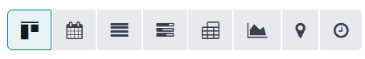

The different view options are:

- :ref:`Kanban <event_essentials/dashboards/kanban>` (default)
- :ref:`Calendar <event_essentials/dashboards/calendar>`
- :ref:`List <event_essentials/dashboards/list>`
- :ref:`Gantt <event_essentials/dashboards/gantt>`
- :ref:`Pivot <event_essentials/dashboards/pivot>`
- :ref:`Graph <event_essentials/dashboards/graph>`
- :ref:`Map <event_essentials/dashboards/map>`
- :ref:`Activity <event_essentials/dashboards/activity>`

If at any time the user desires to navigate back to the main dashboard, they can do so by going to
:menuselection:`Events app --> Events`.

By default, the :guilabel:`Events` dashboard shows *all* the events in the database.

.. _event_essentials/dashboards/kanban:

Kanban view
-----------

The Kanban view is the default view of the main :guilabel:`Events` dashboard, and is represented by
the view option displayed as the :guilabel:`two downward-facing columns` icon, located in the
upper-right corner.

This view showcases all the events in the database in their respective stages. By default, the
stages are: :guilabel:`New`, :guilabel:`Booked`, :guilabel:`Announced`, :guilabel:`Ended`, and
:guilabel:`Cancelled`.

.. image:: event_essentials/kanban-dashboard.png
   :align: center
   :alt: The default Kanban dashboard of the Odoo Events application.

.. note::
   The :guilabel:`Ended` and :guilabel:`Cancelled` stages are folded, by default, and located to the
   right of the other stages.

To add a new stage to the Kanban pipeline, click the :guilabel:`+ Stage` button, located to the
far-right of all the stages. Doing so reveals a :guilabel:`Stage...` text field, in which the name
of the new stage can be entered. When ready, click :guilabel:`Add` to add the new stage to the
Kanban pipeline. Users can also click :kbd:`Esc`, or simply click away, to discard.

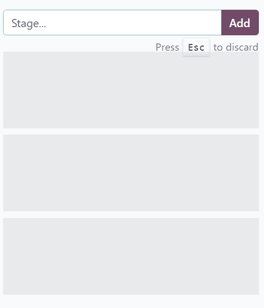

There are two ways to edit event Kanban stages.

One, users can hover their cursor beside the stage title to reveal a :guilabel:`⚙️ (gear)` icon.
When clicked, a drop-down menu appears with various options.

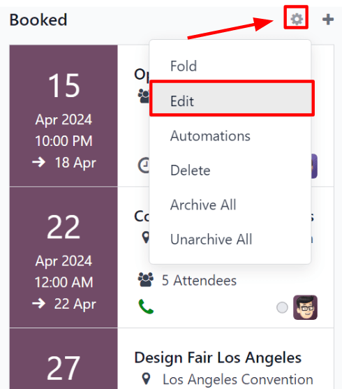

Select :guilabel:`Edit` from this list to reveal an :guilabel:`Edit:(stage name)` pop-up window.

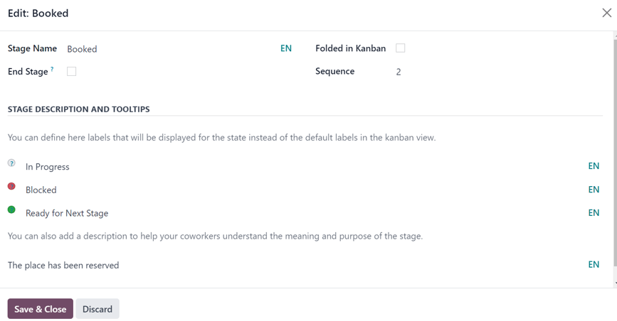

From here, users can modify the configurations of this particular stage however they'd like. Then,
when all the necessary edits are complete, they can click :guilabel:`Save & Close` to save and
implement their changes, or :guilabel:`Discard` to discard them.

The second way users can edit event Kanban stages is to navigate to :menuselection:`Events app -->
Configuration --> Event Stages`. Then, from the :guilabel:`Event Stages` page, users can select an
existing stage from the list to modify it on a separate page, or click :guilabel:`New` to create a
new one.

Every event is represented by an individual Kanban card, which displays its most pertinent
information.

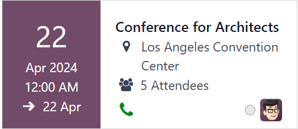

On each event card, users can find the scheduled date of the event, the name of the event, the
location, the number of expected :guilabel:`Attendees`, any scheduled activities related to the
event, the status of the event, and the person responsible for the event.

To quickly add a new event to a pipeline, click the :guilabel:`➕ (plus)` icon at the top of the
stage to which the event should be added to reveal a blank Kanban card to fill out.

.. image:: event_essentials/blank-kanban-card.png
   :align: center
   :alt: Typical blank kanban card to fill out in the Odoo Events application.

In this blank Kanban card, enter the name of :guilabel:`Event`, along with the start and end
:guilabel:`Date` and time.

Then, either click :guilabel:`Add` to add it to the stage and edit it later, or click
:guilabel:`Edit` to add the event to stage and edit its configurations on a separate page.

Each event card can be dragged-and-dropped into any stage on the Kanban pipeline, providing easy
organizational access.

.. _event_essentials/dashboards/calendar:

Calendar view
-------------

The calendar view of the :guilabel:`Events` dashboard can be accessed by clicking the :guilabel:`📆
(calendar)` icon in the upper-right corner. Doing so transforms the dashboard into a calendar
showing the current :guilabel:`Month`, by default.

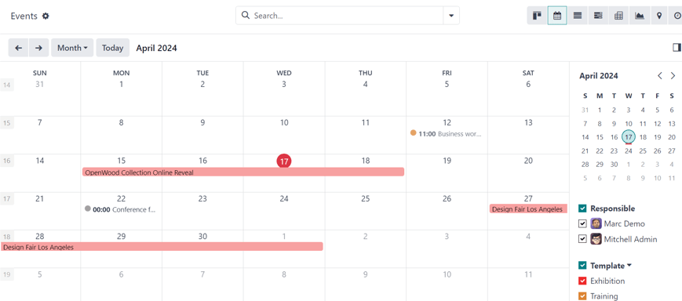

To change the type of calendar, click the default :guilabel:`Month` drop-down menu in the upper-left
corner to reveal a drop-down menu of other calendar view options. Those options are:
:guilabel:`Day`, :guilabel:`Week`, :guilabel:`Month` (default), :guilabel:`Year`, and
:guilabel:`Show weekends` (default).

Navigate to past or future dates using the :guilabel:`⬅️ (left arrow)` or :guilabel:`➡️ (right
arrow)` buttons. Quickly return to the current date by clicking the :guilabel:`Today` button.

The right sidebar showcases a smaller version of the monthly calendar, along with
:guilabel:`Responsible` and :guilabel:`Template` sections, each listing selectable responsibles and
event templates in the database, respectively.

Clicking on a date on the calendar reveals a :guilabel:`New Event` pop-up window.

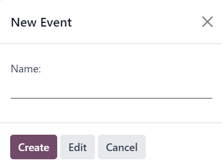

In this pop-up window, enter a :guilabel:`Name` for the event to be scheduled for that desired date.

Then, click either :guilabel:`Create` to create the event and add it to the calendar, or
:guilabel:`Edit` to create the event, add it to the calendar, and edit its configurations right away.

If the user no longer wishes to add an event on this date, either click :guilabel:`Cancel` or
:guilabel:`X` to remove the :guilabel:`New Event` pop-up window.

.. _event_essentials/dashboards/list:

List view
---------

The list view of the :guilabel:`Events` dashboard can be accessed by clicking the :guilabel:`≣
(bars)` icon in the upper-right corner. Doing so reveals all the event information presented in an
organized list.

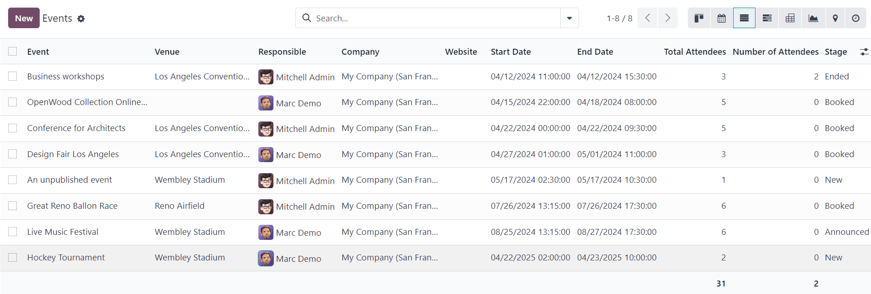

The following informative columns are available in this view, by default:

- :guilabel:`Event`
- :guilabel:`Venue`
- :guilabel:`Responsible`
- :guilabel:`Company`
- :guilabel:`Website`
- :guilabel:`Start Date`
- :guilabel:`End Date`
- :guilabel:`Total Attendees`
- :guilabel:`Number of Attendees`
- :guilabel:`Stage`

For additional column options, click the :guilabel:`(optional columns drop-down)` menu, located to
the far-right of the column titles.

.. _event_essentials/dashboards/gantt:

Gantt view
----------

The gantt view of the :guilabel:`Events` dashboard is accessible by clicking the :guilabel:`three
black-and-white horizontal bars` icon in the upper-right corner. Doing so reveals the dashboard as
a series of rows and columns, with the months as columns and the various event venues as rows.

By default, the gantt view shows the current :guilabel:`Year` with the current month highlighted.

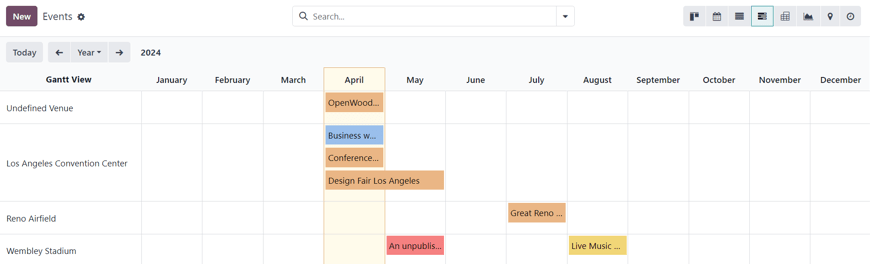

Located inside the gantt view, are the various scheduled events for those designated times (e.g.
Month, Week, etc.).

To change the shown amount of time on the gantt view, click the default :guilabel:`Year` drop-down
menu in the upper-left corner. Doing so reveals a drop-down menu of other time options, including:
:guilabel:`Day`, :guilabel:`Week`, :guilabel:`Month`, and :guilabel:`Year` (default).

Navigate to past or future dates using the :guilabel:`⬅️ (left arrow)` or :guilabel:`➡️ (right
arrow)` buttons. Quickly return to the current date by clicking the :guilabel:`Today` button.

Clicking on a desired block of the gantt view reveals a :guilabel:`Create` pop-up window.

.. image:: event_essentials/create-popup-window-gantt.png
   :align: center
   :alt: The create pop-up window in the gantt view of the main Odoo Events dashboard.

In this pop-up window, proceed to create and configure an event. When all desired configurations are
complete, click :guilabel:`Save & Close` to add it to the gantt view.

.. _event_essentials/dashboards/pivot:

Pivot view
----------

The pivot view of the :guilabel:`Events` dashboard is accessible by clicking the :guilabel:`chart`
icon in the upper-right corner. Doing so reveals an abbreviated pivot table of basic event-related
metrics, which can be expanded (and customized) in a number of different ways.

To learn more about the various ways the pivot view can be configured, checkout the :ref:`pivot view
documentation <reporting/using-pivot>`.

.. _event_essentials/dashboards/graph:

Graph view
----------

The graph view of the :guilabel:`Events` dashboard is accessible by clicking the :guilabel:`Graph`
icon in the upper-right corner. Doing so reveals a default bar chart of event-related data, but this
dashboard can be viewed in a number of different graph styles, with various filtering options.

To learn more about the various ways the graph view can be utilized, checkout the :ref:`graph view
documentation <reporting/using-graph>`.

.. _event_essentials/dashboards/map:

Map view
--------

The map view of the :guilabel:`Events` dashboard is accessible by clicking the :guilabel:`Map`
button, which is represented by a :guilabel:`map waypoint` icon, in the upper-right corner. Doing so
reveals a interactive world map, showcasing the various locations of events in the database.

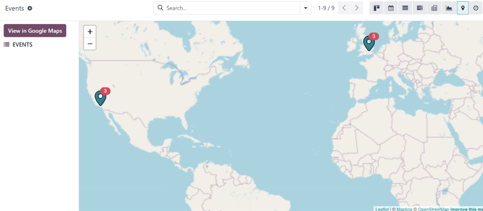

Clicking on any location pin on the map reveals a pop-up window, showing the address of the event,
along with an :guilabel:`Open` button and a :guilabel:`Navigate to` button.

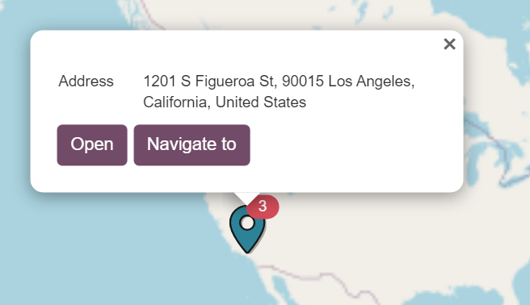

If there are multiple events at a single location, represented by a number beside the map waypoint,
the :guilabel:`Open` button reveals an *Events* page, listing all the events for that particular
location. However, if there is only one event at a location, clicking :guilabel:`Open` reveals that
specific event page.

The :guilabel:`Navigate to` button opens a *Google Maps* page on a new browser tab, showing
directions for how to navigate to that event venue from the user's current location.

Clicking the :guilabel:`View in Google Maps` button opens a separate browser tab, showing a *Google
Maps* page with location indicators on all the event venues shown in the Odoo *Events* application.

.. _event_essentials/dashboards/activity:

Activity view
-------------

The activity view of the :guilabel:`Events` dashboard is accesible by clicking the :guilabel:`🕘
(clock)` icon. Doing so reveals all the scheduled activities related to events in a color-coded
chart.

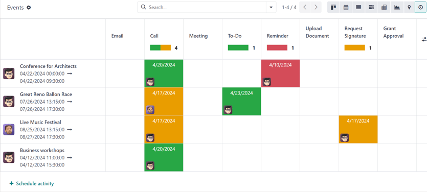

Each column on the chart represents a different activity type, and each row represents a separate
event those activities are associated with.

New activities can be scheduled from this view in two different ways. The user could click into the
square of the desired activity and event, and proceed to schedule the event in the resulting pop-up
window.

Or, click :guilabel:`+ Schedule activity`, located at the bottom of the events row, which opens a
:guilabel:`Search: Event` pop-up window. From here, select the desired event, and proceed to
schedule the desired activity.

To learn more about activities in Odoo, refer to the :doc:`activities documentation
<../../essentials/activities>`.

Settings
========

To access the event settings and feature options in Odoo *Events*, navigate to
:menuselection:`Events app --> Configuration --> Settings`. From here, tick the checkboxes beside
the desired settings and/or features, and click :guilabel:`Save` to activate them.

Events section
--------------

In the :guilabel:`Events` section of the :guilabel:`Settings` page, there are selectable features
that can be enabled to add various elements to events created with the Odoo *Events* application.

.. image:: event_essentials/settings-events-section.png
   :align: center
   :alt: The Events section on the Odoo Events settings page in the Odoo Events application.

The :guilabel:`Schedule & Tracks` feature allows users to manage and publish a schedule with tracks
for events. *Tracks* is a catch-all term that refers to talks, lectures, demostrations,
presentations, and other similar elements that users may choose to include as part of an event.

When the :guilabel:`Schedule & Tracks` feature is enabled, two additional fields appear beneath it:
:guilabel:`Live Broadcast` and :guilabel:`Event Gamification`.

The :guilabel:`Live Broadcast` feature lets users air tracks online, via a *YouTube* integration.

The :guilabel:`Event Gamification` feature lets users share a quiz after any event track, in order
for attendees to gauge how much they learned from the track they just saw/heard. Companies can also
benefit from this feature, in that the subsequent responses and results of the quizzes can help
determine where a company's strengths and weaknesses are, when it comes to their presentations.

Next, is the :guilabel:`Online Exhibitors` feature. This feature allows uers to display sponsors and
exhibitors on event pages, which can serve as a valuable incentive to encourage partners and
businesses to participate in the event.

The :guilabel:`Jitsi Server Domain` field represents an external conferencing service that is
integrated with Odoo. It is what is used to create and host virtual conferences, community rooms,
and other similar elements for events.

.. note::
   The :guilabel:`Jitsi Server Domain` field is populated, by default.

The :guilabel:`Community Chat Rooms` feature allows users to create virtual conference rooms for
event attendees, providing them with a centralized place to meet and discuss anything related to the
event.

Lastly, there is the :guilabel:`Booth Management` feature. This feature provides users with the
ability to create and manage event booths and booth reservations. When enabled, users can create
different booth tiers, with individual price points, and sell them to interested parties.

Registration section
--------------------

The :guilabel:`Registration` section of the :guilabel:`Settings` page provides selectable settings
that are directly related to event registration.

.. image:: event_essentials/settings-registration-section.png
   :align: center
   :alt: The Registration section in the Odoo Events settings page in the Odoo Events application.

The :guilabel:`Tickets` setting allows users to sell event tickets, via standard sales orders.

The :guilabel:`Online Ticketing` setting creates a selectable *Event Ticket* product type on product
forms, which provides users with the ability to sell event tickets online, via their
website/eCommerce store.

Attendance section
------------------

In the :guilabel:`Attendance` section of the :guilabel:`Settings` page, there is a selectable
setting that is directly related to how attendees can attend/enter the event.

.. image:: event_essentials/settings-attendance-section.png
   :align: center
   :alt: The Attendance section in the Odoo Events Settings page in the Odoo Events application.

The :guilabel:`Use Event Barcode` setting, when activated, enables barcode (and QR code) scanning
for attendees to enter the event. This provides attendees with quick access, and helps Odoo users
easily track, manage, and analyze all event attendees.

The :guilabel:`Barcode Nomenclature` field, beneath the :guilabel:`Use Event Barcode` setting, is
set to :guilabel:`Default Nomenclature`, by default, but can be changed at any time.

.. seealso::
   - :doc:`sell_tickets`
   - :doc:`track_manage_talks`
