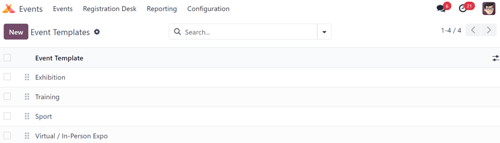
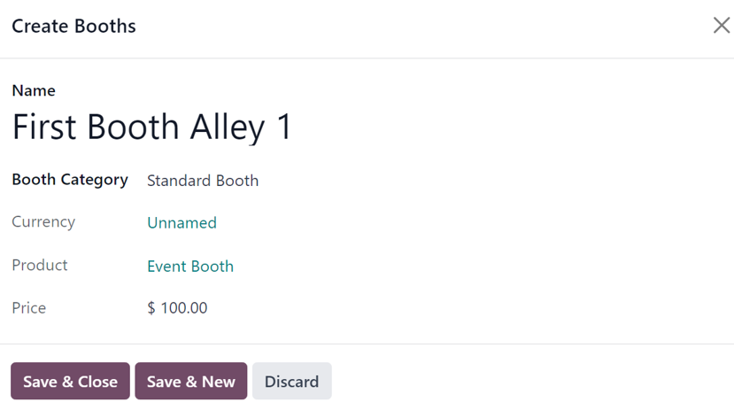

===============
Event templates
===============

The Odoo *Events* application provides users with the ability to customize and configure event
templates, which can be used to expedite the event-creation process.

These templates can be created and personalized in the application, and then selected from an event
form, in order to quickly apply a series of settings and elements to the new event, all of which can
be further modified, if needed.

Event templates page
====================

In the Odoo *Events* application, event templates can quickly be created and modified.

To begin, navigate to :menuselection:`Events app --> Configuration --> Event Templates`. Doing so
reveals the :guilabel:`Event Templates` page. Here, users can find all the existing event templates
in the database.

By default, Odoo provides users with three pre-configured event templates: :guilabel:`Exhibition`,
:guilabel:`Training`, and :guilabel:`Sport`. All of these pre-configured event templates that Odoo
provides by default have their own unique customizations applied to them.

To change how these event templates appear on the *Template* drop-down field on an event form, users
can drag-and-drop them into any desired order, using the :guilabel:`six block` icons, located to the
left of each event template line on the :guilabel:`Event Templates` page.

Create event template
=====================

There are two ways users can create and configure an event template in Odoo *Events*.

Either navigate to :menuselection:`Events app --> Configuration --> Event Templates`, and click the
:guilabel:`New` button in the upper-left corner. Doing so reveals a blank event template form that
can be customized in a number of different ways.

Or, on an event form, start typing the name of a new event template in the *Template* field, and
click :guilabel:`Create and edit...` from the resulting drop-down menu. Doing so reveals a *Create
Template* pop-up window, featuring all the same configurable fields and elements found on a standard
event template form.

.. note::
   Clicking :guilabel:`Create "[template name]"` from the resulting drop-down menu, via the
   *Template* field on an event form creates the event template in the database, but does **not**
   present the user with the *Create Template* pop-up window.

   The event template would have to be modified, by selecting it on the *Event Templates* page
   (:menuselection:`Events app --> Configuration --> Event Templates`).

Event template form
-------------------

All the fields on a standard :guilabel:`Event Template` form are *also* on the *Create Template*
pop-up window, accessible via the *Template* field on an event form.

.. image:: event_templates/event-template-form.png
   :align: center
   :alt: A standard event template form in the Odoo Events application.

Start by providing the event template with a name in the :guilabel:`Event Template` field, located
at the top of the form.

Beneath that field, there is a series of selectable checkboxes, all of which are related to how the
event menu will be displayed on the event web page.

- :guilabel:`Website Submenu`: Odoo presents an event-specific submenu of selectable options that
  are related to that specific event. When this checkbox is ticked, every other checkbox in this
  series is automatically ticked, as well. Users can then choose to untick (deselect) any of the
  checkbox options, as desired.
- :guilabel:`Tracks Menu Item`: adds a menu item that takes visitors to a separate page, showcasing
  all the tracks planned for that specific event.
- :guilabel:`Track Proposals Menu Item`: adds a menu item that takes visitors to a separate page, in
  which they can fill out a customized form to propose a track (talk, lecture, presentation, etc.)
  to happen during the event.
- :guilabel:`Booth Menu Item`: adds a menu item that takes visitors to a separate page, where an
  event booth can be purchased. Event booths can be customized and configured in the
  :guilabel:`Booths` tab of the event template form, from the *Booth Categories* page
  (:menuselection:`Events app --> Configuration --> Booth Categories`). But first, users **must**
  create a booth product with the required *Event Booth* option set as the :guilabel:`Product Type`
  on the product form.
- :guilabel:`Exhibitors Menu Item`: adds a menu item that takes visitors to a separate page,
  showcasing all the exhibitors related to that specific event. Icons representing those exhibitors
  are also found on the footer of every event-specific web page, as well.
- :guilabel:`Community`: adds a menu item allowing attendees to access pre-configured virtual
  community rooms to meet with other attendees, and discuss various topics related to the event.
  When this checkbox is ticked, another checkbox becomes available: :guilabel:`Allow Room Creation`.
- :guilabel:`Allow Room Creation`: this option is directly related to the :guilabel:`Community`
  option, and allows visitors to create community rooms of their own.
- :guilabel:`Register Button`: adds a button at the end of the event submenu that takes visitors to
  the event-specific registration page when clicked.

Once the desired checkboxes have been ticked, select an approrpriate :guilabel:`Timezone` for the
event from the available drop-down menu.

Then, for organizational purposes, users have the option to add :guilabel:`Tags` to this event
template.

There is also the option to :guilabel:`Limit Registrations` to this specific event template by
ticking that checkbox. If ticked, proceed to enter the number of :guilabel:`Attendees` this template
should be limited to.

Beneath those general information fields at the top of the event template form, there are five tabs:

- :ref:`Tickets <create_events/event_form_tickets>`
- :ref:`Communication <create_events/event_form/communication>`
- :ref:`Booths <event_templates/event_template_form/booths>`
- :ref:`Questions <create_events/event_form/questions>`
- :ref:`Notes <create_events/event_form/notes>`

.. _event_templates/event_template_form/booths:

Booths tab
~~~~~~~~~~

The :guilabel:`Booths` tab on an event template form is the only tab that differentiates itself from
a standard event form, where the other tabs (:guilabel:`Tickets`, :guilabel:`Communication`,
:guilabel:`Questions`, and :guilabel:`Notes`) are present and configured using the same process.

.. important::
   In order for a booth or booth category to be created, an event booth product **must** be created
   in the database first, with the *Product Type* set to *Event Booth*. **Only** products with that
   specific configuration can be selected in the required *Product* field of a booth or booth
   category form.

.. note::
   Event booths can be created and customized in two ways in the Odoo *Events* application. Either
   in the :guilabel:`Booths` tab of an event template form, or by navigating to
   :menuselection:`Events app --> Configuration --> Booth Categories`.

To add a booth from the :guilabel:`Booths` tab of an event template form, click :guilabel:`Add a
line`. Doing so reveals a blank :guilabel:`Create Booths` pop-up window.

Start by providing a :guilabel:`Name` for this booth in the corresponding field at the top of the
pop-up window.

Then, select an appropriate :guilabel:`Booth Category` from the drop-down field below. Booth
categories can be created and modified from the *Booth Categories* page in the *Events* application,
which is accessible by navigating to :menuselection:`Events app --> Configuration --> Booth
Categories`.

.. tip::
   A :guilabel:`Booth Category` can be created directly from this field on the :guilabel:`Create
   Booths` pop-up window. To accomplish that, type the name of the new booth category in the
   :guilabel:`Booth Category` field, and select either :guilabel:`Create` or :guilabel:`Create and
   edit...` from the resulting drop-down menu.

   Clicking :guilabel:`Create` merely creates the category, which can (and should be) customized at
   a later date. Clicking :guilabel:`Create and edit...` reveals a new :guilabel:`Create Booth
   Category` pop-up window, from which the category can be configured in a number of different ways.

   .. image:: event_templates/create-booth-category-popup.png
      :align: center
      :alt: The Create Booth Category pop-up window in the Odoo Events application.

   From this pop-up window, proceed to name the :guilabel:`Booth Category`, modify its
   :guilabel:`Booth Details` settings, configure its :guilabel:`Sponsorship` options (if
   applicable), and leave an optional :guilabel:`Description` to explain any pertinent details
   related to this specific category of booths.

   There is also the option to add a photo/visual representation of the booth category, via the
   :guilabel:`camera` icon in the upper-right corner.

   When all desired configurations are complete, click the :guilabel:`Save & Close` button.

   The same configurations and options are available by navigating to :menuselection:`Events app -->
   Configuration --> Booth Categories`, and clicking :guilabel:`New`.

Once the desired :guilabel:`Booth Category` is selected, the remaining fields on the
:guilabel:`Create Booths` pop-up window (:guilabel:`Currency`, :guilabel:`Product`, and
:guilabel:`Price`) autopopulate, based on information configured for that selected :guilabel:`Booth
Category`.

.. note::
   These fields **cannot** be modified from the :guilabel:`Create Booths` pop-up window. They can
   only be modified from the specific booth category form page.

When all desired configurations are complete, click :guilabel:`Save & Close` to save the booth, and
return to the event template form. Or, click :guilabel:`Save & New` to save the booth, and start
creating another booth on a fresh :guilabel:`Create Booths` pop-up window. Click :guilabel:`Discard`
to remove all changes, and return to the event template form.

Once the booth has been saved, it appears in the :guilabel:`Booths` tab on the event template form.

Use event templates
===================

Once an event template is complete, it is accessible on all event forms in the Odoo *Events*
application.

To use an event template, navigate to :menuselection:`Events app --> New` to open a new event form.

From the event form, click the :guilabel:`Template` field to reveal all the existing event templates
in the database. They appear in the same order as they are listed in on the *Event Templates* page
(:menuselection:`Events app --> Configuration --> Event Templates`).

Select the desired event template from the :guilabel:`Template` drop-down field on the event form,
and all the pre-configured settings automatically populate the event form, thus saving users time
during the event creation process.

Any of these pre-configured settings related to the selected event template chosen in the
:guilabel:`Template` field on an event form can be modified, as desired.

.. seealso::
   - :doc:`event_essentials`
   - :doc:`create_events`
