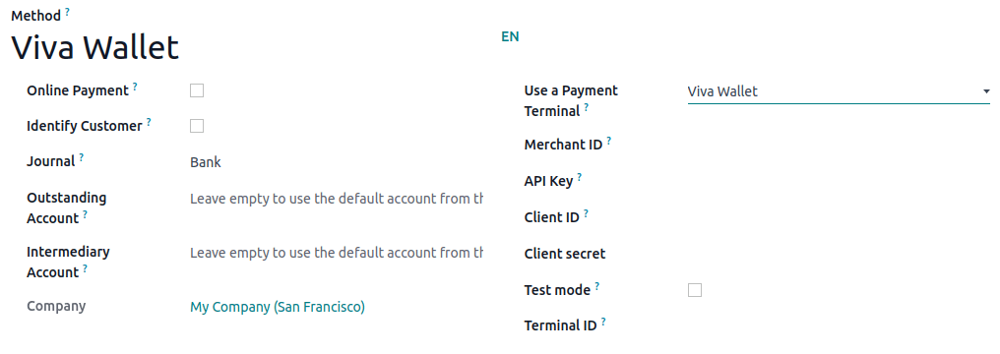
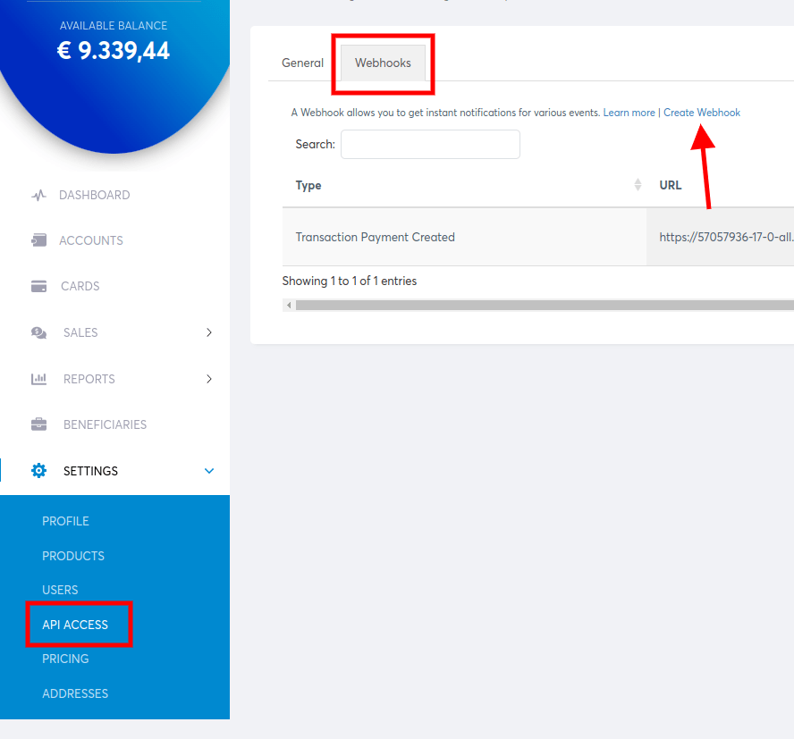

===========
Viva Wallet
===========

Connecting a **Viva Wallet payment terminal**  allows you to offer a fluid payment flow to your
customers and ease the work of your cashiers.

.. note::
   Viva Wallet lets you turn your phone into a mobile card reader: `Tap On Phone
   <https://www.vivawallet.com/gb_en/blog-tap-on-phone-gb>`_.

Configuration
=============

Start by creating your Viva Wallet account on `Viva Wallet's website <https://www.vivawallet.com>`_.

Configure the payment method
----------------------------

Activate **Viva Wallet** in the settings by going to :menuselection:`Point of Sale --> Configuration
--> Settings --> Payment Terminals` and enabling :guilabel:`Viva Wallet`.

Then, create the payment method:

- Go to :menuselection:`Point of Sale --> Configuration --> Payment Methods`, click
  :guilabel:`Create`, and complete the :guilabel:`Method` field with your payment method's name;
- Set the :guilabel:`Journal` field as :guilabel:`Bank` and the :guilabel:`Use a Payment Terminal`
  field as :guilabel:`Viva Wallet`;
- Enter your **Merchant ID** and **API Key**. `Find your Merchant ID and API Key
  <https://developer.vivawallet.com/getting-started/find-your-account-credentials/merchant-id-and-api-key/>`_.
- Enter your **Client ID** and **Client Secret**. `Find your POS APIs Credentials
  <https://developer.vivawallet.com/getting-started/find-your-account-credentials/pos-apis-credentials/>`_.
- Select if you are in production or test mode.

- Enter your **Terminal ID**. `You can use your phone as terminal
  <https://developer.vivawallet.com/tutorials/pos-terminals/tap-on-phone/>`_.

  .. image:: viva_wallet/get-terminal-id.png
     :alt: payment method creation form

- Save your configuration to get the url for the webhook

Register the generated webhook
------------------------------

Copy the :guilabel:`Webhook` generated and register it in your account.
`Webhooks for payments Transaction Payment Created <https://developer.vivawallet.com/webhooks-for-payments/transaction-payment-created/>`_.

Link the payment method to a POS
--------------------------------

To add a **payment method** to your point of sale, go to :menuselection:`Point of Sale -->
Configuration --> Settings`. Select the POS, scroll down to the :guilabel:`Payments` section, and
add your payment method for **Viva Wallet** in the :guilabel:`Payment Methods` field.
